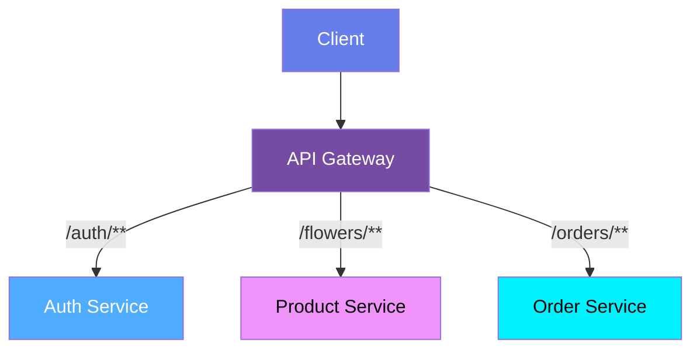

# 🌸 Flower Shop Backend

Backend for an online flower shop built with **Java** and **Spring Boot** using a **microservices architecture**.

## 📖 API Documentation

Swagger documentation:

👉 https://app.swaggerhub.com/apis-docs/floria-466/Floria/1.0.0?view=uiDocs

## 🏗️ Architecture

The project follows a **microservices architecture**.

Current services:

- API Gateway
- Eureka Server
- User Service
- Product Service
- Order Service

## 🚀 Features

- User authentication with JWT
- Product catalog
- Advanced product filtering
- Multiple flower types and colors per product
- Order management
- REST API
- Swagger API documentation
- Docker support

## 🛠️ Tech Stack

- Java 21
- Spring Boot
- Spring Security (JWT)
- Spring Data JPA (Hibernate)
- Spring Cloud Gateway
- REST API
- PostgreSQL
- Redis
- Docker & Docker Compose
- AWS S3
- Maven
